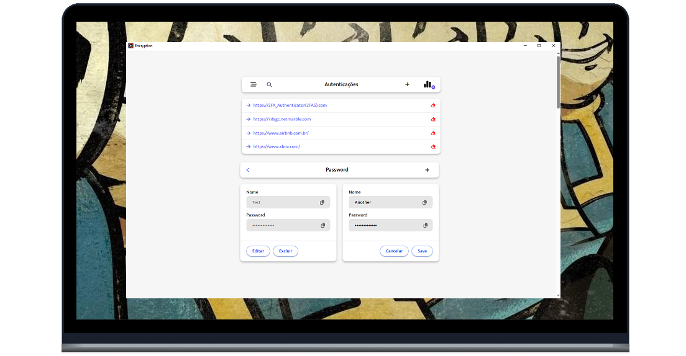

<h1 align="center">
  
  
Auth Password

</h1>

  <a href="#-tecnologias">Tecnologias</a>&nbsp;&nbsp;&nbsp;|&nbsp;&nbsp;&nbsp;
  <a href="#-projeto">Projeto</a>&nbsp;&nbsp;&nbsp;|&nbsp;&nbsp;&nbsp;
  <a href="#-layout">Layout</a>&nbsp;&nbsp;&nbsp;|&nbsp;&nbsp;&nbsp;
  <a href="#-como-executar">Como executar</a>&nbsp;&nbsp;&nbsp;|&nbsp;&nbsp;&nbsp;
  <a href="#-licença">Licença</a>

  

 

 

  

## ✨ Tecnologias

Esse projeto foi desenvolvido com as seguintes tecnologias:

- [Tauri](https://v2.tauri.app/)
- [Vue3](https://vuejs.org/)
- [Rust](https://www.rust-lang.org)
- [TypeScript](https://www.typescriptlang.org/)

## 💻 Projeto

O AuthPassword é um app que faz o gerenciamento de senhas de forma organizada para a melhor experiência do usuário.

## 🔖 Layout

Você pode visualizar o layout do projeto através da imagem representada acima.

## 🚀 Como executar

- Clone o repositório
- Adicione dependencias: Tauri `cargo install` && Vue `yarn install`
- Compile o aplicativo: `npm run tauri build`
- Encontre o arquivo executável na pasta `src-tauri/target/release/bundle`

Agora você pode visualizar e utilizar a aplicação.

## 📄 Licença

Esse projeto está sob a licença MIT. Veja o arquivo [LICENSE](LICENSE.md) para mais detalhes.

---

Feito com ♥ by WellingtonPLF 👋🏻 [Contact Me 😊](https://mail.google.com/mail/?view=cm&fs=1&to=wellplf@gmail.com)